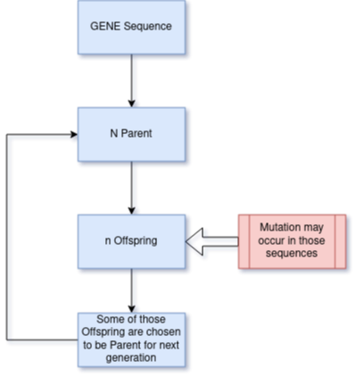

# Simulating Gene Sequence Evolution

---


---
$$\begin{matrix}
i/j &a&t&g&c\\
a &1-\alpha-\beta-\gamma &\alpha &\beta &\gamma\\
t & \alpha & 1-\alpha-\epsilon-\delta &\epsilon&\delta \\
g &\beta & \epsilon & 1-\beta-\epsilon-\zeta&\epsilon\\
c&\gamma &\delta &\zeta &1-\delta-\gamma-\epsilon\end{matrix}$$

* $m_{ij}$ is the proability of $i->j$

$$\frac{dx_a}{dt}=1-\alpha-\beta-\gamma$$
---
For sake of similicity
$$\begin{matrix}
i/j &a&t&g&c\\
a &1-2\alpha-\beta &\alpha &\beta &\alpha\\
t & \alpha & 1-2\alpha-\beta &\alpha&\beta \\
g &\beta & \alpha & 1-2\alpha-\beta&\alpha\\
c&\alpha &\beta &\alpha &1-2\alpha-\beta\end{matrix}$$

* Proability of purine to purine and pyramidine to pyramidine is same.
* Proability of purine to pyramidine is same with condition of $\alpha<\beta<1$
$$\frac{dx_a}{dt}=1-2\alpha-\beta$$
at Steady State
$$\frac{dx_a}{dt}=1-2\alpha-\beta=0$$
$$1=2\alpha+\beta$$

---

```


```
$f(x)=\sum_{i\neq j}m_{ij}$
$g(x)=\sum_{i=j}m_{ij}$

---