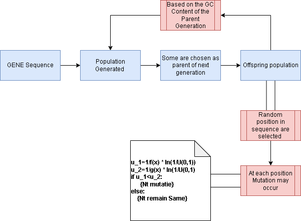

# Simulating Gene Sequence Evolution

---


---
$$\begin{matrix}
i/j &a&t&g&c\\
a &1-\alpha-\beta-\gamma &\alpha &\beta &\gamma\\
t & \alpha & 1-\alpha-\epsilon-\delta &\epsilon&\delta \\
g &\beta & \epsilon & 1-\beta-\epsilon-\zeta&\epsilon\\
c&\gamma &\delta &\zeta &1-\delta-\gamma-\epsilon\end{matrix}$$

* $m_{ij}$ is the proability of $i->j$

$$\frac{dx_a}{dt}=1-\alpha-\beta-\gamma$$
---
For sake of similicity
$$\begin{matrix}
i/j &a&t&g&c\\
a &1-2\alpha-\beta &\alpha &\beta &\alpha\\
t & \alpha & 1-2\alpha-\beta &\alpha&\beta \\
g &\beta & \alpha & 1-2\alpha-\beta&\alpha\\
c&\alpha &\beta &\alpha &1-2\alpha-\beta\end{matrix}$$

* Proability of purine to purine and pyramidine to pyramidine is same.
* Proability of purine to pyramidine is same with condition of $\alpha<\beta<1$
$$\frac{dx_a}{dt}=1-2\alpha-\beta$$
at Steady State
$$\frac{dx_a}{dt}=1-2\alpha-\beta=0$$
$$1=2\alpha+\beta$$

---

```


```
$f(x)=\sum_{i\neq j}m_{ij}$
$g(x)=\sum_{i=j}m_{ij}$

---
$$dP(x,t)/dt = \sum_i [p_i * P(x-i+1,t) + q_i * P(x+i-1,t)]
              + (2/3) * P(x,t) * 2 / (L - 1) 
              - \sum_i [p_i * P(x-i,t) + q_i * P(x+i,t)]
              - (1/6) * P(x-1,t) / (L - 1) - (1/6) * P(x+1,t) / (L - 1)
              - (2/3) * P(x,t) * 2 / (L - 1)$$

$$dX(t)/dt = \sum_i [p_i * (X(t) - i + 1) * P(X(t) - i + 1, t)              + q_i * (X(t) + i - 1) * P(X(t) + i - 1, t)]
             + (2/3) * X(t) 
             - \sum_i [p_i * (X(t) - i) * P(X(t) - i, t)              + q_i * (X(t) + i) * P(X(t) + i, t)]
             - (1/6) * (X(t) - 1) * P(X(t) - 1, t) 
             - (1/6) * (X(t) + 1) * P(X(t) + 1, t) 
             - (2/3) * X(t)
$$

$$f(x) = \sum_{i=1}^{L-x} p_i + 2/3
$$
$$g(x) = \sum_{i=1}^{x} q_i + 2/3
$$
$$dPx/dt =(\sum{pi.P(x-i+1,t) + qiP(x+i-1,t)}) \\+ (2/3)P(x,t)(2/(L-n))$$

$$dPx/dt = Σ [f(i)*P(x-i+1,t) - g(i)*P(x,t)]\\ + Σ [f(-i)*P(x+i-1,t)\\ - g(-i)*P(x,t)] \\   + (2/3)*P(x,t)*(2/(L-n))
\\2/3 = \sum_{i=1}^{L-x} p_i + \sum_{i=1}^{x} q_i$$